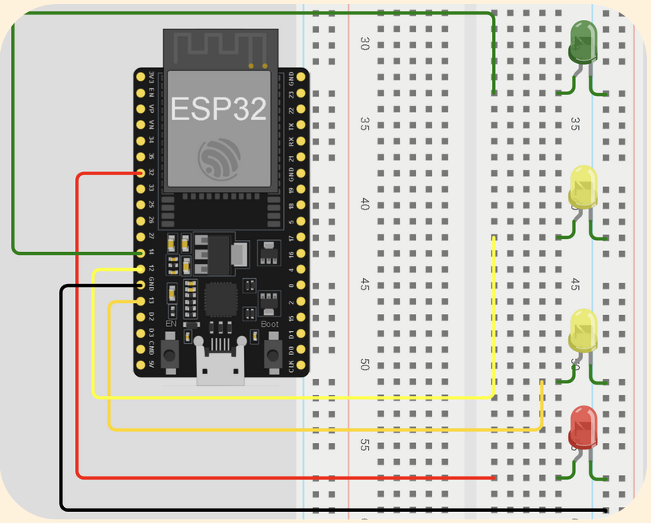
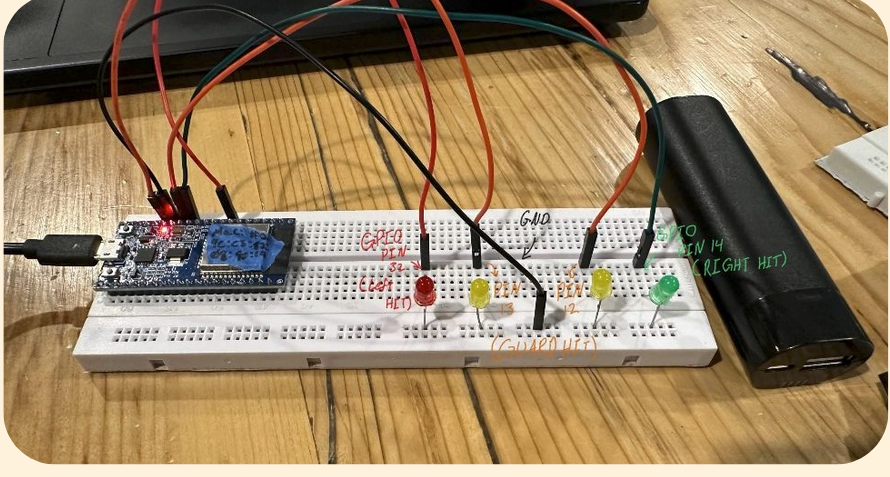

# Bluetooth-Fencing-Scoring-System

### Notes before we start:
1. This is very much still a WIP
2. This system DOES NOT GROUND, bell guard hits will register as will touches on the strip
3. No guarantee of timing accuracy, should be about right but I have not tested how accurate it is
4. Forked from https://github.com/MatthewKazan/Bluetooth-Fencing-Scoring-System

### Suggested materials:
- [ESP32][esp32] - $15 x3 (need one per box)
- [Solderable breadboard](https://www.adafruit.com/product/1609) - $5 x2 (need one per box)
- [Piezo buzzer](https://www.adafruit.com/product/160) - $1.50 x2 (need one per box)
-  [5mm LED](https://www.adafruit.com/product/4203) - $5
-  [Epee socket](https://www.absolutefencinggear.com/af-clear-epee-socket.html) - $8 x2 (need one per box)
-  Solder/Soldering iron
-  Small portable charger with short(3") usb->micro usb cable x2
-  Some sort of protective housing to put the circuit in, I modeled and 3d printed one but a cardboard box would work just as well. Make sure the Micro usb port is visible from the outside.

### Required software
- [Arduino IDE](https://www.arduino.cc/en/software/)
- Python
- Some way to run a localhost webserver (e.g., vscode live server extension)

## Building the circuits:
<pre>
<h1>Client</h1>

</pre>

1. Wire the 3v3 pin to the B-wire (middle) on the body cord
2. Wire GPIO pin 18 to the A-wire (closer side) on the body cord
3. Wire GPIO pin 4 to the C-wire (farther side) on the body cord
4. Repeat for the second fencer
  

<pre>
<h1>Server</h1>

</pre>

1. GPIO pin 32 to the left LED (red)
2. GPIO pin 13 to the left guard LED (yellow)
3. GPIO pin 14 to the right LED (green)
4. GPIO pin 12 to the right guard LED (yellow)
5. (optional) GPIO pin 23 to a buzzer
6. Wire all negative leads of the LEDs (and buzzer) to a GND pin

## Building the program:
1. Go to tools and set board to ESP32 dev module, set port to the port where you board is plugged in.
2. We first must find the MAC address of the ESP32 board, using the included get_mac.ino program. The MAC address will be output to the serial monitor, you must manually convert it to the correct format seen in client.ino and server.ino (0xYY where YY is the corresponding 2 characters in the mac address). Do this for all 3 boards and take note of them.
3. Set `uint8_t peerMac[6]` in client.ino to the of the board you are using for server.ino and set `uint8_t peerMac1[6]` and `uint8_t peerMac2[6]` server.ino to the MAC addresses of each of the client boards
4. Download client.ino and server.ino to there respective boards. Use body cord to connect to weapon and test. I use a small portable phone charger plugged into the arduino's mircro usb port for power while in use.

See this [tutorial](https://randomnerdtutorials.com/esp-now-esp32-arduino-ide/) for explanation of code.

## Using the GUI
- Ensure you have python installed
- Pick your favorite way to run a **localhost webserver** to serve `scoreboard.html`. I use a live server extension in VS Code
- Create a virtual environment with `python -m venv .venv`
- Run `pip install -r requirements.txt`
- Start the live server
- Make sure **BLUETOOTH IS TURNED ON** on your laptop or what ever device is running it
- Run `python scoreserver.py`

### Helpful links:
1. See this [tutorial](https://randomnerdtutorials.com/esp-now-esp32-arduino-ide/) for explanation of code.
2. [ESP32 board overview](https://learn.adafruit.com/adafruit-huzzah32-esp32-feather)

[esp32]: https://www.amazon.com/ESP-WROOM-32-Development-Microcontroller-Integrated-Compatible/dp/B08D5ZD528?crid=1KQGSILLUSPXO&dib=eyJ2IjoiMSJ9.-OAftzGp2pa3bNKeqEG_7TZMLABy3y0V00ME9yq1mYbiRqIdQyjnsVatafK_RPPNLigZoBzOKFbpC5kCrswuaAl_-PC8_L4lnAW0-hRIaJpX6viJM2QxOZVYvb1vMHUncHTFGhRuwvxtwHDU4t-1J9Or1Q5muVG-blMYT2JGweIOJGwtyYJCZweP4cZOxsaMuvLuR_c5hTpUSzoyjhLYMDiV_rjagSXUSF47oOTN6pI.WDO2CBKejsCBxxisU2B3sZDryFxeOPsFxibK6ho9YlQ&dib_tag=se&keywords=esp32%2Badafruit&qid=1764278487&sprefix=esp32%2Badafruit%2Caps%2C104&sr=8-3&th=1
